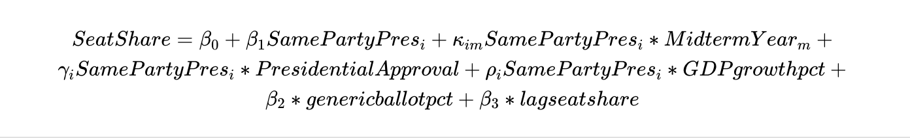
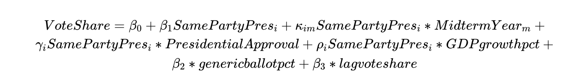
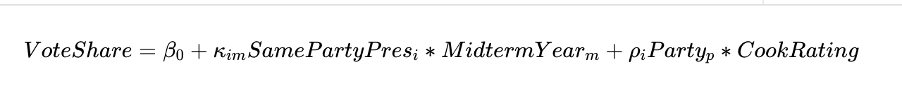

# Overview

Over the course of the semester, I have been building models to forecast the outcomes
of the 2022 US House Elections. With each week devoted to a different theme that can 
be considered predictive of an election's outcome, I have had the opportunity 
to work with a variety of datasets and consider the best context for each variable. 
In this post, I detail my three models:
  1. Nationwide Seat Share
  2. Nationwide Vote Share
  3. Vote Share in Ohio's 1st District House Race
  
Specifically, I discuss the decisions and trade-offs that went into each of the models. 
My final predictions are that Republicans will gain control over the seat, winning
23 new seats and taking a lead of 236-199 seats. However, the confidence interval is large and captures a small probability of the Democrats maintaining control, or at least a smaller loss margin. Similarly, I predict that Republicans will reach the majority of the nationwide 
popular vote at 52.5% but have a confidence interval of (49.7,52), suggesting my 
model is not 95% confident that they will win the majority. Finally, for Ohio's 1st district, I implement three different regression methods. Averaged together, they forecast that Incumbent Steve Chabot (R) will beat challenger Greg Landsman (D), but
the 95% confidence interval again captures the possibility of Chabot losing the seat. 


# Nationwide Models

## Dataset and Setup 

For my nationwide models, I join a number of datasets with information from the 
1948-2020 elections. My primary dataset is the voting information for each year's election,
where the unit of analysis is the party*year, including variables like: the party's vote share, seat share, 
the party of the president after the election, and the incumbent party of the house majority.
I then built variables for whether or not the party matches the incumbent president's party, whether or not it is 
a midterm year, the party's seat share and vote share from the previous election.

Next, I merged this with the party's average generic ballot polling in the 52 days prior to the election. In generic ballot polls,
the surveyor asks the likely voter which party they are planning to support in the upcoming election. These are performed at a nationwide-level
and provide a pulse on each party's favorableness. I also included economic data into my main dataset, 
incorporating the gdp growth percentage in the quarter prior to the election. 
Finally, I included the sitting president's mean approval ratings into my analysis 
to test whether house candidates are penalized or rewarded for the performance of the president.

I chose to perform this at a nationwide, rather than district, level because I was not
confident that I could capture the effects of recent redistricting. While redistricting 
certainly presents limitations in a nationwide model, I am running this analysis under
the assumption that the effects of redistricting "wash out," such that both parties will
gain/lose a few seats. 


```{r setup, include=FALSE}
knitr::opts_chunk$set(echo = TRUE)
library(tidyverse); library(knitr); library(stargazer);library(tinytex);library(lubridate)
```

```{r explore,message=FALSE,warning=FALSE,include=FALSE}
# Read in historical data
inc<-read_csv("/Users/elliegrueskin/Documents/Fall 2022/Gov 1347/Gov1347/data/by_nation/inc_pop_vote_df.csv")%>%
  mutate(MidtermYear=ifelse(year%%4,1,0)) 
# Read in generic poll data, 52 days before election
# For some reason, the 2008 data was off so I did that year separately
gen_poll<-read_csv("/Users/elliegrueskin/Documents/Fall 2022/Gov 1347/Gov1347/data/by_nation/GenericPolls1942_2020.csv")%>%
  filter(days_until_election<52&year!=2008)%>%
  group_by(year)%>%
  summarise(D=mean(dem),R=mean(rep))%>%
  pivot_longer(cols=c('D','R'),names_to='party',values_to='poll_pct')
gen_poll_2<-read_csv("/Users/elliegrueskin/Documents/Fall 2022/Gov 1347/Gov1347/data/by_nation/GenericPolls1942_2020.csv")%>%
  filter(days_until_election<52&year==2008)%>%
  group_by(year)%>%
  summarise(D=mean(rep),R=mean(dem))%>%
  pivot_longer(cols=c('D','R'),names_to='party',values_to='poll_pct')
gen_poll<-bind_rows(gen_poll,gen_poll_2)

# Read in gdp data
gdp<-read_csv("/Users/elliegrueskin/Documents/Fall 2022/Gov 1347/Gov1347/data/by_nation/GDP_quarterly.csv")%>%
  mutate(Eyr=ifelse(year%%2,0,1)) %>%
  filter(Eyr==1&quarter_yr==3)%>%
  dplyr::select(year,GDP_growth_pct)
library(stringr)

# Read in presidential approval data 
pres<-read_csv("/Users/elliegrueskin/Documents/Fall 2022/Gov 1347/Gov1347/data/by_nation/pres_approval_gallup_1941-2022.csv")%>%
  group_by(year)%>%
  summarise(approval=mean(approve))

# Join datasets together
inc_gen<-inner_join(inc,gen_poll,by=c('year','party'))
all<-inner_join(inc_gen,gdp,by='year')
all<-inner_join(all,pres,by='year')

#Clean data to have lagged data
all_2<-all %>% 
  arrange(party,year)%>%
  dplyr::mutate(Pres_inc_party=case_when(year==1948~'NA',TRUE~dplyr::lag(president_party,  n=1)))%>%
  dplyr::mutate(Inc_party_pres=ifelse(Pres_inc_party==party,1,0),
         Inc_party_house=ifelse(H_incumbent_party==party,1,0),
         lag_seats=lag(seats),
         lag_pv=lag(majorvote_pct))%>% filter(year!=1948)
```


## Model Description, Justification

To build my forecasting models, I used a linear model to predict each party's 
voteshare and seatshare, using all 72 observations (36 years,2 parties) 
and the following variables: \
  1. Interaction term for whether it is a Midterm Year interacted with a binary for whether the party represented that of the incumbent president (SamePartyPres). Coefficient:kappa(im) \
  2. Interaction term for the presidential approval rating interacted with SamePartyPres. Coefficient: gamma(i) \
  3. Interaction Term for the GDP growth percentage in the last quarter interacted with SamePartyPres. Coefficient: rho(i) I chose GDP growth percentage as opposed to RDI or inflation because GDP is highly linked to Inflation and can stabilize better across shocks. \
  4. The party's generic ballot percentage. Coefficient: beta(1) \
  5. The party's seatshare or voteshare from the prior election. Coefficient: beta(2) \n
Omissions: Ad data because the most important advertisements are run leading up to the elections,
so it would be challenging to incorporate into my model. Similarly, I did not 
include demographic, voting administration, turnout data because I wasn't sure if it
would be particularly helpful at the nationwide level

Here are the exact formulas written out: 

```{r seat_reg,  fig.align='center', out.width='100%', fig.cap='Seat Share Equation'}

```


```{r vote_reg,  fig.align='center', out.width='100%', fig.cap='Vote Share Equation'}

```


I split my dataset into two parts: training (70%) and testing (30%) so I could 
perform out of sample validation on my models. 

```{r model build,include=FALSE}
# Model

# Set training and testing datasets, add in data for 2022
set.seed(232)
split1<- sample(c(rep(0, ceiling(0.7 * nrow(all_2))), rep(1, 0.3 * nrow(all_2))))
train <- all_2[split1 == 0, ]  
test <- all_2[split1 == 1, ]  %>%
  add_row(year = 2022, party = 'D',GDP_growth_pct=.6,poll_pct=45.4,approval=42.1,
          Inc_party_pres=1,Inc_party_house=1,MidtermYear=1,lag_seats=222,lag_pv=51.5)%>%
  add_row(year = 2022, party = 'R',GDP_growth_pct=.6,poll_pct=46.5,approval=42.1,
          Inc_party_pres=0,Inc_party_house=0,MidtermYear=1,lag_seats=212,lag_pv=48.5)

lm_seats<-lm(seats~Inc_party_pres*(MidtermYear+approval+GDP_growth_pct)+poll_pct+lag_seats,data=train)
lm_vote<-lm(majorvote_pct~Inc_party_pres*(MidtermYear+approval+GDP_growth_pct)+poll_pct+lag_pv,data=train)

```

## Results and Interpretation
```{r model output,warning=FALSE}
stargazer(lm_seats,lm_vote,type='text')
```

As these results show, each variable is significant in predicting a 
party's  seatshare and voteshare at the 5% significance level. There are high Adjusted R-sq values,
or proportion of the variance explained by the models, sitting at .923 for the seatshare model
and .827 for the voteshare model.

To interpret the coefficients, it is helpful to group together all  the variables that start with "Inc_party_pres," or whether the row's party is the same as the president's party. While the (beta(1)) on the "Inc_party_pres" is extremely large, this represents the case where the president has a 0% approval rating because it assumes that this term, Inc_party_pres:approval, is 0. Hence, this term proves useful in building the regression but is challenging to interpret on its own. Instead, I will focus on the interaction variables themselves. 

Gamma(1), or Inc_party_pres:MidtermYear, represents the association
between the incumbent president's party's outcome and the election occurring during a midterm year.During midterm years, the incumbent president's party is associated with a 28 seatshare loss and a 4.3 percentage point drop in the 
popular vote, holding all the other variables in this regression constant. On the other hand, Gamma(0) (MidtermYear) represents the association between the non-incumbent party and the Midterm Year and is positive. During midterm years, the non-incumbent party is associated with 14 more seats and a 2.2 percentage point increase in voteshare. This follows the historical patterns, which show that midterms 
are often "a referendum on the incumbent president," and thus 

That's not to say that the incumbent president's party will only drop during midterm years. As
the regression shows, there are positive coefficients for Gamma(1) and Rho(1), which respectively represent the associations between the incumbent president's party and the president's approval rating
and the country's gdp growth. More precisely, every 1 percentage point increase in a president's approval
rating is associated with an increase of 1.5 seats and .166 percentage points in voteshare. Similarly, every 1 percent increase in gdp growth from the past quarter is associated with an increase of 2 seats and .17 percentage points in voteshare. On the other hand, the party opposing the incumbent president
is negatively associated with the presidential approval rating and the country's gdp. 

Finally, it is interesting to examine the non-interaction variables: the generic 
ballot polling Beta(2) and the lag Beta(3), or prior, seatshare and voteshare by party. As expected,
all the variables are positively and significantly associated with the party's electoral outcomes.
For every 1 percentage point increase in the party's generic ballot polling, the party's
 increases by 1.92 seats and .292 percentage points in voteshare. I use the lagged
 variables as another form of an intercept that can hold account for where the party
 was prior to the election. I find it more helpful than a simple binary for control of the house.
 Each seat a party currently holds is associated with .65 seats in the upcoming eletion and each
 voteshare percentage point from the prior election is associated with a 0.4 voteshare in the upcoming election. 


## Model Validation

Next, I test how well my model performed for Republicans and Democrats in sample (training dataset) out of sample (testing dataset). I use root mean squared error, or the standard
deviation of the residuals (differences between predictions and observed results).

```{r model validation, message=FALSE,warning=FALSE,echo=FALSE}
test$pred_seats<-predict(lm_seats,test)
test$pred_vote<-predict(lm_vote,test)
train$pred_seats<-predict(lm_seats,train)
train$pred_vote<-predict(lm_vote,train)
rmse_r_st_test<-sqrt(mean(as.numeric(unlist((test[test$party=='R'&test$year!=2022,'pred_seats']-test[test$party=='R'&test$year!=2022,'seats'])))^2))
rmse_r_st_train<-sqrt(mean(as.numeric(unlist((train[train$party=='R'&train$year!=2022,'pred_seats']-train[train$party=='R'&train$year!=2022,'seats'])))^2))
rmse_d_st_test<-sqrt(mean(as.numeric(unlist((test[test$party=='D'&test$year!=2022,'pred_seats']-test[test$party=='D'&test$year!=2022,'seats'])))^2))
rmse_d_st_train<-sqrt(mean(as.numeric(unlist((train[train$party=='D'&train$year!=2022,'pred_seats']-train[train$party=='D'&train$year!=2022,'seats'])))^2))
rmse_r_vt_test<-sqrt(mean(as.numeric(unlist((test[test$party=='R'&test$year!=2022,'pred_vote']-test[test$party=='R'&test$year!=2022,'majorvote_pct'])))^2))
rmse_r_vt_train<-sqrt(mean(as.numeric(unlist((train[train$party=='R'&train$year!=2022,'pred_vote']-train[train$party=='R'&train$year!=2022,'majorvote_pct'])))^2))
rmse_d_vt_test<-sqrt(mean(as.numeric(unlist((test[test$party=='D'&test$year!=2022,'pred_vote']-test[test$party=='D'&test$year!=2022,'majorvote_pct'])))^2))
rmse_d_vt_train<-sqrt(mean(as.numeric(unlist((train[train$party=='D'&train$year!=2022,'pred_vote']-train[train$party=='D'&train$year!=2022,'majorvote_pct'])))^2))
```

```{r rmse output,echo=FALSE,warning=FALSE,message=FALSE}
rmse<-tibble(model=c('Seatshare','Seatshare','Voteshare','Voteshare'),
              party=c('Republican','Democrat','Republican','Democrat'),
          test_rmse=c(rmse_r_st_test,rmse_d_st_test,rmse_r_vt_test,rmse_d_vt_test),
          train_rmse=c(rmse_r_st_train,rmse_d_st_train,rmse_r_vt_train,rmse_d_vt_train))%>%
  mutate(index_rmse=(2*test_rmse+train_rmse)/3)
rmse %>% kable()

ggplot(test,aes(x=seats,pred_seats,label=year,col=party))+geom_point()+geom_smooth(method=lm,se=FALSE)+labs(title='Predicted Seats vs. Actual Seats Using Testing Data ')+scale_color_manual(values=c("Blue","Red"))+facet_wrap(~party)
ggplot(test,aes(x=majorvote_pct,pred_vote,label=year,col=party))+facet_wrap(~party)+geom_point()+geom_smooth(method=lm,se=FALSE)+geom_label()+labs(title='Predicted Voteshare vs. Actual Voteshare on Test Data')+scale_color_manual(values=c("Blue","Red"))

```

I created a simple index that weights the testing rmse twice as much as that of training and then divides the result by 3. I chose to weight the testing rmse higher because it represents the out-of-sample prediction and therefore evaluated how the model performs on data the model hasn't  seen. These results first demonstrate that for my seat share model, the model performs
better for Democrats. On the other hand, the voteshare model performs slightly better
for the Republicans. 

## Predictions and Uncertainty

One limitation of the linear model is that the sum of the Democratic and Republican
seat/voteshare may not sum up nicely to 100 or 435. As a work around, I predict
the point estimate for Democrats' voteshare using their model's predicted value and voteshare for Republicans using 435-PredictionSeatShareDemocrats. An important note is that this type of model is that I doesn't include the likely possibility of a seat being held 
by a member of one of the non-major parties. Similarly, I predict the voteshare for Republicans
and then compute 100-PredictionVoteShareRepublicans to get the predicted Democratic voteshare.

For each prediction, I draw a 95% confidence interval to be 95% certain that 
this range will capture the true mean of the seat/voteshare. Similar to my point estimates,
I capture the Republican seatshare/Democratic voteshare upper and lower bounds by subtracting 
by the other party's lower and upper bounds, respectively.


```{r preds,include=FALSE}
# Set training and testing datasets, add in data for 2022
set.seed(232)
split1<- sample(c(rep(0, ceiling(0.7 * nrow(all_2))), rep(1, 0.3 * nrow(all_2))))
train <- all_2[split1 == 0, ]  
test <- all_2[split1 == 1, ]  %>%
  add_row(year = 2022, party = 'D',GDP_growth_pct=.6,poll_pct=44.7,approval=42.2,
          Inc_party_pres=1,Inc_party_house=1,MidtermYear=1,lag_seats=222,lag_pv=51.5)%>%
  add_row(year = 2022, party = 'R',GDP_growth_pct=.6,poll_pct=45.3,approval=41.7,
          Inc_party_pres=0,Inc_party_house=0,MidtermYear=1,lag_seats=212,lag_pv=48.5)

test$pred_seats<-predict(lm_seats,test,interval='prediction')
test$pred_vote<-predict(lm_vote,test,interval='prediction')
# test_preds<-cbind(test,pred_seats,pred_vote)
# tab<-data.frame(cbind(test[test$year==2022&test$party=='D',c(3,2,22)],
#   test[test$year==2022&test$party=='R',c(3,2,23)]))%>%
#   mutate(pred_vote_D[,'fit']=100-pred_vote[,'fit'],
#          pred_vote_D[,'upr']=100-pred_vote[,'upr'],
#          pred_st_R=435-pred_seats)
# tab<-data.frame(rbind(tab[,c(1:3,7)]%>% rename('pred_vote'='pred_vote_D'),tab[,c(4:6,8)]%>%
#                         rename('pred_seats'='pred_st_R','party'='party.1','year'='year.1')))%>%
#   mutate()
#   
# 
#   mutate(pred_seats=ifelse(party=='R',))

```
  
```{r preds output, echo=FALSE} 
tab<-data.frame(bind_rows(test[test$year==2022&test$party=='D',c(3,2,22)],
                          test[test$year==2022&test$party=='R',c(3,2,23)]))%>%
  mutate(pred_seats_fit=ifelse(party=='R',435-lag(pred_seats[,1]),pred_seats[,1]),
         pred_seats_lwr=ifelse(party=='R',435-lag(pred_seats[,3]),pred_seats[,2]),
         pred_seats_upr=ifelse(party=='R',435-lag(pred_seats[,2]),pred_seats[,3]),
         pred_vote_fit=ifelse(party=='D',100-lead(pred_vote[,1]),pred_vote[,1]),
         pred_vote_lwr=ifelse(party=='D',100-lead(pred_vote[,3]),pred_vote[,2]),
         pred_vote_upr=ifelse(party=='D',100-lead(pred_vote[,2]),pred_vote[,3]))%>%
  select('party','year',pred_seats_fit,pred_seats_lwr,pred_seats_upr,
         pred_vote_fit,pred_vote_lwr,pred_vote_upr)
tab%>% kable()
ggplot(data=tab,aes(x=party,y=pred_seats_fit,col=party))+geom_point()+geom_errorbar(aes(ymax=pred_seats_upr,ymin=pred_seats_lwr))+labs(title='Predicted Nationwide Voteshare for 2022',subtitle='Error bars represent 95% confidence interval, Dashed line is at 237 seats or split seat share')+scale_color_manual(values=c("Blue","Red"))+geom_hline(yintercept = 217,linetype='dashed')
ggplot(data=tab,aes(x=party,y=pred_vote_fit,col=party))+geom_point()+geom_errorbar(aes(ymax=pred_vote_upr,ymin=pred_vote_lwr))+labs(title='Predicted Nationwide Voteshare for 2022',subtitle='Error bars represent 95% confidence interval, Dashed line is at 50% or split voteshare')+scale_color_manual(values=c("Blue","Red"))+geom_hline(yintercept = 50,linetype='dashed')

```

My model predicts that Democrats will lose their house majority, lose 21 seats, and land at 199 seats. For Republicans, the model forecasts that they will regain the house majority, gain about 24 seats and land at 236 seats. Similarly, the model
forecasts that Republicans will gain the majority of the voteshare with 52.5% of the vote and Democrats will capture 47.5% of the vote.

However, these point estimates are only a starting point. The 95% confidence interval 
for each party's seatshare includes a range of +/-20 from the estimate, signaling
that the model is only 95% confident about the true value landing in a wide range. 

As the graphs above show, the confidence intervals overlap for both voteshare and seatshare, so
they see a very small probability in which Democrats win control of the house or 
receive over 50% of the voteshare.

## Discussion:

Through these models - which are primarily based upon incumbent, economic, and polling data -
I anticipate that Republicans will regain control of the House and capture the majority 
of the voteshare tomorrow. However, the confidence intervals are proportionally very large,
so I am not as confident in the exact margins.

# Ohio 1st District 


Next, I zoom into my specific district: Ohio-01. This district is viewed as a toss-up according to Cook,
with 538 predicting it'll go Republican. The sitting incumbent, Steve Chabot, is a Republican
who has served 15 terms (only lost once since 1995). Democrat and City Council member  Greg Landsman
is the challenger, and has recently been polling at about even with Chabot. My entire dataset
for this part includes all election data going back to 1948 for Ohio-01.

In former election cycles, this district has been considered one of the most competitive. 
In 2020, Cook rated it as a "Tossup R" district and Chabot beat the captured 53.7% of the vote.
Howver, the recent redistricting cycle has likely brought in more democrats to the district, making it a more looked-after district. Cook still believes it's a Tossup R again, signifying
that they anticipate it will be a close race but that Chabot will win again. FiveThirtyEight
similarly predicts that Chabot will win and capture 52.6% of the popular vote. However,
their overlapping confidence intervals show that they see a path in which Landsman wins.By simulation, they anticipate that Chabot will win 82% of the time and Landsman the other 18%.

```{r ohio setup, include=FALSE}
oh<-read_csv("/Users/elliegrueskin/Documents/Fall 2022/Gov 1347/Gov1347/data/by_district/incumb_dist_1948-2020.csv")
oh<-oh %>% filter(st_cd_fips==3901)%>%
  select(state,st_cd_fips, year, DemCandidate,RepCandidate,winner_party, RepStatus,DemStatus,RepVotesMajorPercent,DemVotesMajorPercent,president_party)%>%
  mutate(Uncontested=ifelse(DemVotesMajorPercent==0|RepVotesMajorPercent==0,1,0))

# Republican rows
oh_rep<-oh %>% select(st_cd_fips, state,year, winner_party,president_party,Uncontested,RepCandidate, RepStatus,RepVotesMajorPercent)
# Dem rows
oh_dem<-oh %>% select(st_cd_fips, state,year, winner_party,president_party,Uncontested,DemCandidate, DemStatus,DemVotesMajorPercent)
# Bind together
oh_total<-bind_rows(oh_rep,oh_dem)
oh_total<-oh_total %>%
  mutate(party=ifelse(is.na(RepVotesMajorPercent),'D','R'),
    CandidateName=ifelse(party=='R',RepCandidate,DemCandidate),
    Status=ifelse(party=='R',RepStatus,DemStatus),
    pv2p=ifelse(party=='R',RepVotesMajorPercent,DemVotesMajorPercent))%>%
  filter(pv2p!=0)%>%
  select(state,st_cd_fips, year,party,winner_party,president_party,Uncontested,
         party,CandidateName,Status,pv2p)


# Generic polls
gen_poll_oh<-read_csv('/Users/elliegrueskin/Documents/Fall 2022/Gov 1347/Gov1347/data/by_nation/polls_df.csv')
gen_poll_oh<-gen_poll_oh %>% 
  filter(days_until_election<30)%>%
  group_by(year,party)%>%
  summarise(party_support=mean(support))

#Join datasets together
oh<-left_join(oh_total,gen_poll_oh,by=c('year','party'))%>%
  mutate(MidtermYear=ifelse(year%%4,1,0)) %>% 
mutate_if(is.numeric, ~replace(., is.na(.), 0))

oh<-oh %>%
  group_by(CandidateName)%>%
  arrange(year)%>%
  mutate(term=ifelse(Status=='Incumbent',cumsum(n()),0))%>%
  ungroup()

oh<- oh %>%
  group_by(CandidateName)%>%
  arrange(year)%>%
 mutate(term = 1:n(),
        term=term-1)%>%
  ungroup()

oh<-oh %>%
  group_by(st_cd_fips,party)%>%
  arrange(year)%>%
  mutate(prev=lag(pv2p),Unc_prev=lag(Uncontested),
         approval_cent=party_support-44.6)%>%
  ungroup()%>% filter(Uncontested==0)%>%
  mutate(same_party=ifelse(party==president_party,1,0),
         party_wins=ifelse(party==winner_party,1,0))

#Cook data
cook<-read_csv('/Users/elliegrueskin/Documents/Fall 2022/Gov 1347/Gov1347/data/by_district/cook.csv')%>% 
  filter(state=='OH' & district=='01')

oh_cook<-left_join(oh,cook,by=c('year'))
```

I run three separate models: \

The first uses fundamental data only: 
```{r fund_oh,  fig.align='center', out.width='100%', fig.cap='Equation for Fundamentals Model',echo=FALSE}

```

The next uses some fundamental data and Cook Partisan Voter Index. Each election cycle,
Cook creates a prediction for each district's partisan leaning, which "measures how each district performs at the presidential level compared to the nation as a whole." The scale ranges from safe, solid, lean, toss-up in either party's favor. In this coding, less than 0 means in favor for Republicans and greater than 0 means in favor for Democrats, with -4 being Safe R and 4 being Safe D. 
```{r cook_oh,  fig.align='center', out.width='100%', fig.cap='Equation for Model with Cook Ratings',echo=FALSE}

```

The final regression uses just polling data from the last three cycles (2018-2022)
```{r poll_oh,  fig.align='center', out.width='100%', fig.cap='Equation for Polling Model',echo=FALSE}

```


                        
```{r model Ohio,include=FALSE}
set.seed(232)
split1<- sample(c(rep(0, ceiling(0.7 * nrow(oh))), rep(1, 0.3 * nrow(oh))))
train_oh <- oh[split1 == 0, ]  
test_oh <- oh[split1 == 1, ] 
lm_oh_1<-lm(pv2p~Status +prev+same_party:MidtermYear,data=train_oh)
lm_oh_exp<-lm(pv2p~same_party:MidtermYear+code:party,data=oh_cook)
mean(abs(lm_oh_1$residuals))
mean(abs(lm_oh_exp$residuals))
oh_22<-tibble(year=c(2022,2022),party=c('R','D'),term=c(16,0),Status=c('Incumbent','Challenger'),prev=c(53.7,46.3),code=c(-1,-1),
              MidtermYear=c(1,1),same_party=c(0,1),party_support=c(45.3,44.7))
oh_22$pred_1<-predict(lm_oh_1,oh_22,interval='prediction') 
oh_22$pred_exp<-predict(lm_oh_exp,oh_22,interval='prediction')
test_oh$pred<-predict(lm_oh_1,test_oh)
rmse_r<-sqrt(mean(as.numeric(unlist((test_oh[test_oh$party=='R','pred']-test_oh[test_oh$party=='R','pv2p'])))^2,na.rm=T))

```

## Fundamental and Cook Models
For the fundamental dataset, I performed a 70% training-30% testing data split to test
in-sample and out-of sample errors. The in-sample rmse is 5.6 percentage points while the out-of sample rmse is 9.8.

With my model incorporating Cook ratings, I only had their ratings going
back to 2008, so my dataset was very small. In order to avoid overfitting, I included
all the data for my Cook-based model. The in-sample rmse was 1.74 percentage points.

Here is the regression output : 

```{r Ohio model output, message=FALSE,warning=FALSE,echo=FALSE}
stargazer(lm_oh_1,lm_oh_exp,type='text')

ggplot(data=test_oh,aes(y=pv2p,x=pred,col=party,label=year))+geom_point()+geom_label()+
  labs(title='Actual vs. Predicted Voteshare on Test Data for Fundamental Model',
       subtitle='Straight line represents a perfect 1:1 relationship')+
  scale_color_manual(values=c("Blue","Red"))+geom_abline(slope=1)
# ggplot(data=dat,aes(y=pv2p,x=prev,col=party))+geom_point()+facet_wrap(~party)


```
As the first regression shows, incumbents perform significanty better in Ohio-01,
and for every 1 percentage point increase in the party's previous voteshare, they gain about .5 percentage points. The second regression reports a very high Adjusted R-sq at .88, but
there are only 12 observations so I'm a bit cautious. As expected, Democrats are significantly
better off when the Cook rating is above 0 and vise-versa for Republicans. 

## Polling model

Similar to my Cook-based model, I only had polling info going back to 2008, so my dataset was very small. In order to avoid overfitting, I included
all the data for my polling-based model. In this model, I weight by the polling grade and
the inverse amount of days until election (1/days). 

```{r poll models,include=FALSE}

poll<-read_csv('/Users/elliegrueskin/Documents/Fall 2022/Gov 1347/Gov1347/data/by_district/dist_polls_2018-2022.csv')%>%
  mutate(party=substr(party,1,1))%>%
  filter(party%in%c('D','R'))%>%
  filter(st_cd_fips=='3901')

dat_poll<-left_join(poll,oh,by=c('cycle'='year','party'))%>%
  #add new polls
  add_row(cycle = 2022, party = 'D',pct=49,fte_grade='B/C',end_date='10/16/22',
          election_date='11/8/22')%>%
    add_row(cycle = 2022, party = 'D',pct=49,fte_grade='B/C',end_date='9/21/22',
            election_date='11/8/22')%>%
  add_row(cycle = 2022, party = 'R',pct=46,fte_grade='B/C',end_date='10/16/22',
          election_date='11/8/22',Status='Incumbent')%>%
    add_row(cycle = 2022, party = 'R',pct=46,fte_grade='B/C',end_date='9/21/22',
            election_date='11/8/22',Status='Incumbent')  %>%
  mutate(elec_date=as.Date(parse_date_time(election_date,"mdy")),
         end_date=as.Date(parse_date_time(end_date,"mdy")),
         day_diff=difftime(elec_date,end_date,units='days'),
         # create weights for poll grade
         weight = case_when(str_detect(fte_grade, "A/B") ~ 25,
str_detect(fte_grade, "B/C") ~ 15,
str_detect(fte_grade, "C") ~ 10,
          str_detect(fte_grade, "B") ~ 20,
          str_detect(fte_grade, "A") ~ 30))
mod_poll <- lm(pv2p ~ pct, data = dat_poll,weights=c(weight*I(1/as.numeric(day_diff))))
oh_22_r<-dat_poll %>% filter(cycle==2022&party=='R')
oh_22_r$pred_poll<-predict(mod_poll,oh_22_r,interval='prediction')
mean(abs(mod_poll$residuals))

```
 
 I chose not to use a sample size weighting because all the polls had a sample of 
 500. The regression below demonstrates that in this small sample, there is a very 
 high association between a party's polling percentage and their voteshare. 
 
```{r ohio 2,message=FALSE,warning=FALSE,echo=FALSE}
stargazer(mod_poll,type='text')

as_tibble(oh_22_r[,c('end_date','party','pct','day_diff','fte_grade','pred_poll')])%>%
  arrange(day_diff)

```
In my 2022 predictions, Chabot's expected voteshare has gone down by about .8 percentage points
as the polls tighten. I am not extremely confident in this model because the dataset is so 
limited. So, I will average the predictions for Republicans across all three models with the latter two being weighted twice as heavily because they can better account for redistricting. In my fundamental
model, I predict that Chabot will get 57.9% of the vote while I predict 52.9% and 51.3% in 
my cook and poll-based models, respectively. Averaging across these three with weightings, I get 
that Chabot will get 53.2% of the popular vote while Landsman will get 46.6% of the popular vote. 
Similar to earlier results, the 95% confidence intervals are extremely large, so I 
am not very confident in these results and could easily see Landsman capturing the seat. 

```{r oh predictions, include=FALSE}
(.529*2+.513*2+.579)/5
```


