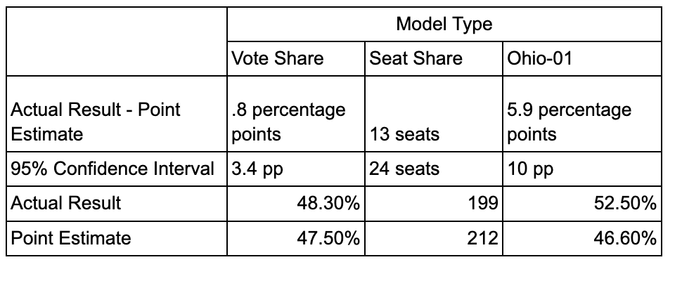

# 1.	Recap

## Predictions
In my nationwide two-party voteshare model, I forecasted that Republicans would receive 52.5% of the vote and Democrats would receive 47.5% of the vote. My 95% prediction interval, which accounts for simulations of 100 trials, stretched about 3.4 percentage points in either direction. This signifies that in 95% of the simulations, Democrats would get anywhere from 47.4 to 50.8% of the national vote. 

Similarly, I predicted that Republicans would obtain 236 seats and Democrats would obtain 199 seats. My prediction interval was once again very large, spanning about 24 seats in either direction. This interval has very large practical meaning because had the Republicans received 211 seats, the election would have been a “red wave” while if the Republicans had received under 217 seats, the Democrats would keep control of the house.

Finally, for Ohio’s 1st district, I forecasted that Incumbent Steve Chabot (R) would beat challenger Greg Landsman (D) with 53.2% of the popular vote. However, the 95% prediction interval was very wide (between 40-60% for both candidates), so I was not as confident in my point estimate. 


## Models 

In both nationwide models, I used a fundamental-based approach with strong penalties for the incumbent party. My dataset’s unit of analysis was race*year, such that for each year, there were individual rows for each party.
 To build my forecasting models, I used a linear model to predict each party’s seatshare and voteshare on all 72 observations (36 years,2 parties) and the following variables:
1. Interaction term for whether it is a Midterm Year interacted with a binary for whether the party represented that of the incumbent president (SamePartyPres). Coefficient:kappa(im)
2. Interaction term for the presidential approval rating interacted with SamePartyPres. Coefficient: gamma(i)
3. Interaction Term for the GDP growth percentage in the last quarter interacted with SamePartyPres. 
4. The party’s generic ballot percentage. 
5. The party’s seatshare or voteshare from the prior election. Coefficient: beta(2) Omissions: 

One limitation of the linear model is that the sum of the Democratic and Republican seat/voteshare may not sum up nicely to 100 or 435. As a work around, I predict the point estimate and 95% prediction interval for Democrats’ voteshare using their model’s predicted value and voteshare for Republicans using 435-PredictionSeatShareDemocrats. Similarly, I predict the voteshare for Republicans and then compute 100-PredictionVoteShareRepublicans to get the predicted Democratic voteshare.

For my Ohio-1st district model, I ran three different models: one that used fundamental data using similar variables to the nationwide models, one that used fundamental data and Cook Partisan Voter Index information, and one with recent polling data. 

# 2.	Accuracy

## Table for Results vs. Predictions for Democrats
```{r seat_reg,  fig.align='center', out.width='100%', fig.cap='Seat Share Equation'}

```
With 2 races still to be called, the Cook Political Report has the nationwide voteshare at 47.6% Democrat, 50.9% Republican, and 1.3% other. Given that I was calculating voteshare from a two-party perspective, I will restructure their percentages to be out of the total two-party voteshare, such that Democratic voteshare is 48.3% (47.6/98.5) and Republican voteshare is 51.7%. Hence, my model was very accurate with only a difference of .8 percentage points. While this difference is practically significant in the context of an election, it is still a small error given the complexity of the problem. And, it performed better than it did on average in my testing dataset, where there was a 1.3 percentage point average error.

On the other hand, my seatshare model did not perform as well. Using forecasted counts, I get that Democrats will have 213 seats and Republicans will have 222 seats. While this is an imperfect final count, it closely follows many pundit predictions. The difference between my point estimates and the actual result was about 14 seats, which is larger than I would have expected (testing dataset had an average of 11 seat error) or liked. 

For Ohio’s 1st-district, my point estimate interval was off by 5.9 percentage points, where the Democrat Landsman received about the voteshare I expected for Incumbent Chabot and vise-versa. My individual regression prediction intervals were substantially large that I was not confident about Chabot winning by 6 percentage points; however, I did not expect Landsman to win by over 5 percentage points.


# 3.	Hypotheses 
a.	Turnout: For all my models, I did not include turnout forecasts or historical data. In this election, youth turnout was incredibly high, helping many Democrats win competitive races. Had I accounted for youth turnout, my models might have been more accurate 
b.	Redistricting: In 2021, many states drew new electoral maps that affected the radius of congressional districts. Specifically, Ohio-01 was redistricted to include more parts of Cincinnati, which have historically voted more left than Ohio’s 1st district. My model included the Cook PVI to try and account for this, but they still thought it was a tossup Republican.

# 4.	Quantitative Tests 
a.	To test whether turnout would have helped my nationwide models, I could include youth polling and/or turnout figures into my model and see if they would have helped with prediction error. I was hesitant to use this because it was harder data to capture over time, but it would be fruitful to explore.

b.	To test the effect of redistricting at the Ohio-1st level, I would have considered adding other ratings into my rating-based model. Then, I could test whether an averaged rating system helped better forecast the changes to Ohio’s 1st electoral map.

It is challenging to test the effect of redistricting at a nationwide level quantitatively, so 
I instead look at a more exploratory approach. I plot the vote curves, or the party's seat share vs vote share, across years to see if the ratios were unusual this year for Democrats and Republicans. 

```{r setup, include=FALSE}
knitr::opts_chunk$set(echo = TRUE)
library(tidyverse); library(knitr); library(stargazer);library(tinytex);library(lubridate)
```

```{r explore,message=FALSE,warning=FALSE,include=FALSE}
# Read in historical data
inc<-read_csv("/Users/elliegrueskin/Documents/Fall 2022/Gov 1347/Gov1347/data/by_nation/inc_pop_vote_df.csv")%>%
  mutate(MidtermYear=ifelse(year%%4,1,0)) 
# Read in generic poll data, 52 days before election
# For some reason, the 2008 data was off so I did that year separately
gen_poll<-read_csv("/Users/elliegrueskin/Documents/Fall 2022/Gov 1347/Gov1347/data/by_nation/GenericPolls1942_2020.csv")%>%
  filter(days_until_election<52&year!=2008)%>%
  group_by(year)%>%
  summarise(D=mean(dem),R=mean(rep))%>%
  pivot_longer(cols=c('D','R'),names_to='party',values_to='poll_pct')
gen_poll_2<-read_csv("/Users/elliegrueskin/Documents/Fall 2022/Gov 1347/Gov1347/data/by_nation/GenericPolls1942_2020.csv")%>%
  filter(days_until_election<52&year==2008)%>%
  group_by(year)%>%
  summarise(D=mean(rep),R=mean(dem))%>%
  pivot_longer(cols=c('D','R'),names_to='party',values_to='poll_pct')
gen_poll<-bind_rows(gen_poll,gen_poll_2)

# Read in gdp data
gdp<-read_csv("/Users/elliegrueskin/Documents/Fall 2022/Gov 1347/Gov1347/data/by_nation/GDP_quarterly.csv")%>%
  mutate(Eyr=ifelse(year%%2,0,1)) %>%
  filter(Eyr==1&quarter_yr==3)%>%
  dplyr::select(year,GDP_growth_pct)
library(stringr)

# Read in presidential approval data 
pres<-read_csv("/Users/elliegrueskin/Documents/Fall 2022/Gov 1347/Gov1347/data/by_nation/pres_approval_gallup_1941-2022.csv")%>%
  group_by(year)%>%
  summarise(approval=mean(approve))

# Join datasets together
inc_gen<-inner_join(inc,gen_poll,by=c('year','party'))
all<-inner_join(inc_gen,gdp,by='year')
all<-inner_join(all,pres,by='year')

#Clean data to have lagged data
all_2<-all %>% 
  arrange(party,year)%>%
  dplyr::mutate(Pres_inc_party=case_when(year==1948~'NA',TRUE~dplyr::lag(president_party,  n=1)))%>%
  dplyr::mutate(Inc_party_pres=ifelse(Pres_inc_party==party,1,0),
         Inc_party_house=ifelse(H_incumbent_party==party,1,0),
         lag_seats=lag(seats),
         lag_pv=lag(majorvote_pct))%>% filter(year!=1948) %>%
  add_row(year = 2022, party = 'D',GDP_growth_pct=.6,poll_pct=45.4,approval=42.1,
          Inc_party_pres=1,Inc_party_house=1,MidtermYear=1,lag_seats=222,lag_pv=51.5,majorvote_pct=48.5,
          seats=212)%>%
  add_row(year = 2022, party = 'R',GDP_growth_pct=.6,poll_pct=46.5,approval=42.1,
          Inc_party_pres=0,Inc_party_house=0,MidtermYear=1,lag_seats=212,lag_pv=48.5,
          majorvote_pct=51.5,
          seats=222)
```
```{r plot, echo=FALSE}
all_2 %>% ggplot(aes(x=majorvote_pct,y=seats,label=year))+geom_point()+geom_label()+facet_wrap(~party)+geom_abline(slope=8.75,intercept=-221)+labs(title='Seat Share Vs. Vote Share by Party, Year',subtitle='Diagonal line represents perfect relationship between two')
```

Any year above the diagonal line means that the party had a better seat share than the voteshare
would've predicted if there was a perfect relationship between the two and vise-versa. Unlike the pattern 
over the last decade where Republicans' seatshare outperformed their voteshare, it appears
that Democrats slightly outperformed their voteshare this year. Hence, the newer electoral maps may also
provide reasoning as to why my voteshare model outperformed by seatshare model.


# 5.	Updates to model in future
As I mentioned in my quantitative tests, I would have experimented with turnout and further redistricting data to see if that would better predict nationwide and district-level data.
 
Additionally, I would be interested in doing a district-by-district model. For this class, I stuck with a nationwide-based approach because I wasn’t confident in redistricting measures by district. However, I think to do a thorough seatshare model, it is best to model it at the individual seat level. I think that this will be much more feasible in the future years because the districts will be the same as their past iterations, so previous voteshare will be more predictive. 

# Conclusion

Overall, I am very grateful to have had the opportunity to model the 2022 midterm elections
and learn more about political and data sciences through the project. I think my model
demonstrated both the potential and limitations of using fundamental-based data, and
I look forward to incorporating these lessons into future modeling endeavors. 


